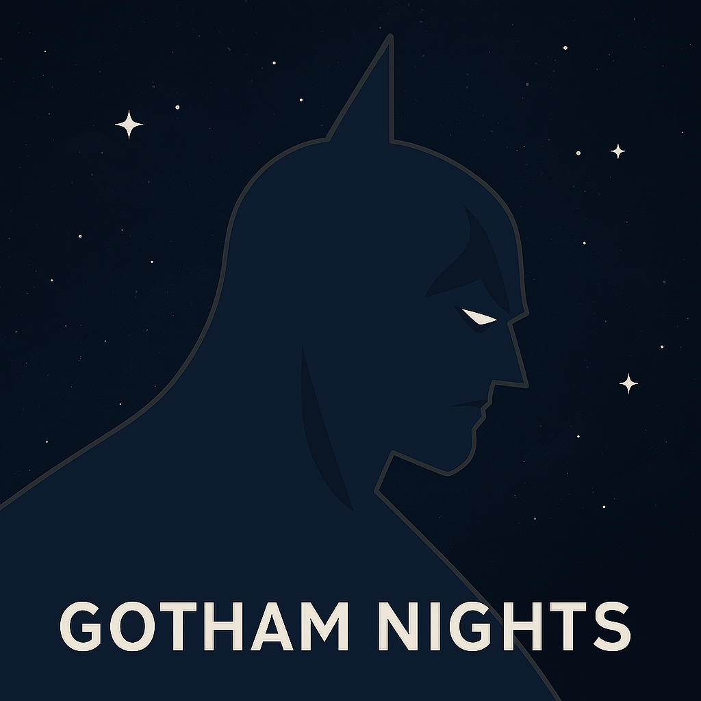

<table>
  <tr>
    <td>
      
    </td>
    <td>
      <h2>Gotham Nights</h2>
      
Gotham Nights is a custom-made dark theme (Night Mode🌙) for Telegram X-Android App.

      
Main color palette: 
      Black(#212121  ), 
      Midnight Blue(#222E3C  ),
      Grey(#303030  ),  
      with Light Blue accent(#1EAAF1  , #7BD1FD  )

    </td>
  </tr>
</table>

### How to Launch:
Just simply open the included ``Gotham Nights.tgx-theme`` [file in Telegram X](https://t.me/Gotham_Nights_tgx_theme/14).

**Open in Telegram**: [t.me/Gotham_Nights](https://t.me/Gotham_Nights_tgx_theme/14) *(recommended)*

Download directly: [github.com/a-partovii/Gotham-Nights.tgx-theme](https://github.com/a-partovii/Gotham-Nights.tgx-theme/archive/refs/tags/v1.1.3.zip)

---

### Preview Screenshots:

<table align="center">
  <tr>
    <td></td>
    <td></td>
    <td></td>
    <td></td>
  </tr>
</table>

